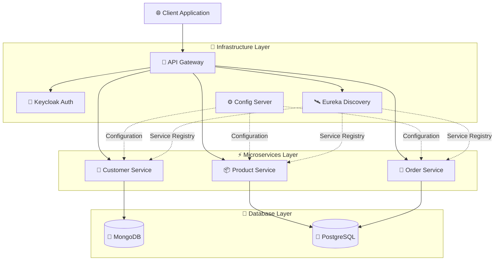

# TradeFlow-MS

> Security-first microservices platform for trade management

## 🚀 Quick Start

```bash
# 1. Start infrastructure (MongoDB, PostgreSQL, Kafka, Keycloak)
docker-compose up -d tf_mongodb tf_postgres tf_kafka tf_zookeeper tf_keycloak

# 2. Start services in order (each in separate terminal)
cd services/config-server && ./mvnw spring-boot:run
cd services/discovery-server && ./mvnw spring-boot:run
cd services/customer-service && ./mvnw spring-boot:run
cd services/product-service && ./mvnw spring-boot:run
```

## 🏗️ Architecture



## 🛠️ Tech Stack

- **Backend:** Java 17, Spring Boot 3.5.10, Spring Cloud 2025.0.1
- **Database:** MongoDB (Customers), PostgreSQL (Products, Orders)
- **Migration:** Flyway (for PostgreSQL schema management)
- **Service Discovery:** Netflix Eureka
- **Configuration:** Spring Cloud Config
- **Message Broker:** Apache Kafka + Zookeeper
- **Authentication:** Keycloak (OAuth2/OpenID Connect)
- **Validation:** Jakarta Validation API
- **ORM:** Hibernate 6.6.41 with JPA

## 📡 Service Ports

| Service          | Port  | Database/Tool                            |
| ---------------- | ----- | ---------------------------------------- |
| Config Server    | 8888  | -                                        |
| Discovery Server | 8761  | -                                        |
| Customer Service | 8090  | MongoDB                                  |
| Product Service  | 8050  | PostgreSQL                               |
| MongoDB          | 27017 | compass://localhost:27017                |
| PostgreSQL       | 5433  | jdbc:postgresql://localhost:5433/product |
| Kafka            | 9092  | -                                        |
| Zookeeper        | 2181  | -                                        |
| Keycloak         | 8080  | http://localhost:8080                    |

## 📝 Roadmap

- [x] Infrastructure setup (Config Server, Eureka, Docker)
- [x] Customer Service CRUD with MongoDB
- [x] Product Service with PostgreSQL + Flyway migrations
- [x] Product Service DTOs and mappers
- [x] Product Service CRUD endpoints (create, findAll, findById, purchase)
- [ ] Order Service
- [ ] API Gateway with load balancing
- [ ] Authentication with Keycloak
- [ ] Kafka event streaming between services

## 🗂️ Project Structure

```
TradeFlow-MS/
├── services/
│   ├── config-server/          # Centralized configuration
│   ├── discovery-server/        # Service registry (Eureka)
│   ├── customer-service/        # Customer CRUD (MongoDB) ✅
│   │   ├── controller/
│   │   ├── service/
│   │   ├── repository/
│   │   ├── model/
│   │   ├── dto/
│   │   ├── mapper/
│   │   ├── exception/
│   │   └── handler/
│   └── product-service/         # Product CRUD (PostgreSQL) ✅
│       ├── controller/          # ✅ REST endpoints (POST, GET, /purchase)
│       ├── service/             # ✅ Business logic
│       ├── repository/          # ✅ JPA repositories
│       ├── model/               # ✅ JPA entities (Product, Category)
│       ├── dto/                 # ✅ Request/Response DTOs
│       ├── mapper/              # ✅ Entity ↔ DTO mapping
│       ├── exception/           # ✅ Custom exceptions
│       ├── handler/             # ✅ Global exception handler
│       └── db/migration/        # ✅ Flyway SQL scripts (V1: schema, V2: data)
└── docker-compose.yml           # Infrastructure containers
```
