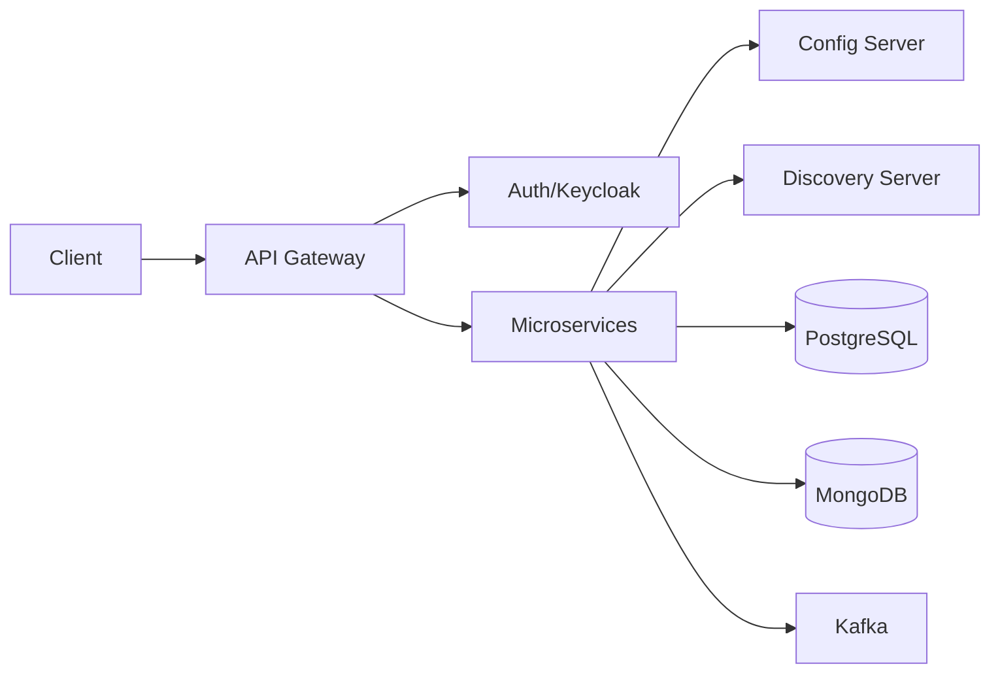

<div align="center">

# TradeFlow-MS

**Security-first microservices platform for scalable e-commerce systems**

[](https://spring.io)
[](https://spring.io)
[](https://openjdk.org)
[](https://docker.com)
[](https://postgresql.org)
[](https://mongodb.com)
[](https://kafka.apache.org)
[](https://keycloak.org)

</div>

---

## Why TradeFlow-MS?

- 🏗️ **Microservices Architecture** — Scalable, independent services with Spring Cloud ecosystem
- ⚡ **Event-Driven Design** — Real-time processing with Apache Kafka messaging
- 🎨 **Modern Stack** — Angular frontend, Spring Boot backend, polyglot persistence

## 🛡️ Cyber Security & Resilience

TradeFlow-MS is engineered with a **security-first mindset**, implementing enterprise-grade protection at every layer of the architecture.

### Security Architecture

┌─────────────────────────────────────────────────────────────┐
│ 🌐 Client Layer │
└────────────────────────┬────────────────────────────────────┘
│ HTTPS/TLS
▼
┌─────────────────────────────────────────────────────────────┐
│ 🚪 API Gateway (Security Shield) │
│ • JWT Token Validation • Rate Limiting (Planned) │
│ • Request Filtering • DDoS Protection (Planned) │
└────────────────────────┬────────────────────────────────────┘
│ Authenticated Requests
▼
┌─────────────────────────────────────────────────────────────┐
│ 🔐 Keycloak (Identity Provider) │
│ • OAuth 2.0 / OpenID Connect │
│ • Single Sign-On (SSO) │
│ • Multi-Factor Authentication (MFA) │
│ • Role-Based Access Control (RBAC) │
└────────────────────────┬────────────────────────────────────┘
│ JWT Tokens
▼
┌─────────────────────────────────────────────────────────────┐
│ 🔒 Internal Microservices │
│ • Service-to-Service Authentication │
│ • Internal Ports Hidden from External Access │
│ • Encrypted Communication (Planned) │
└─────────────────────────────────────────────────────────────┘

````

### 🔐 Security Features

| Layer                  | Feature                              | Status         |
| ---------------------- | ------------------------------------ | -------------- |
| **Authentication**     | Keycloak OAuth 2.0 / OIDC            | ✅ Active      |
| **Authorization**      | Role-Based Access Control (RBAC)     | ✅ Active      |
| **Token Management**   | Secure JWT-based communication       | ✅ Active      |
| **API Protection**     | Gateway as security shield           | 🔄 In Progress |
| **Rate Limiting**      | Request throttling & DDoS protection | 📅 Planned     |
| **Secrets Management** | HashiCorp Vault integration          | 📅 Planned     |
| **Service Mesh**       | mTLS service-to-service encryption   | 📅 Planned     |
| **Audit Logging**      | Security event tracking              | 📅 Planned     |

### 🔑 Key Security Principles

1. **Zero Trust Architecture**
   - No implicit trust between services
   - Every request is authenticated and authorized
   - Internal services are not exposed to external networks

2. **Defense in Depth**
   - API Gateway acts as first line of defense
   - Keycloak provides centralized authentication
   - JWT tokens for secure service communication
   - Database credentials managed securely

3. **Least Privilege Access**
   - Services only access resources they need
   - Role-based permissions enforced at every level
   - Secrets never hardcoded or committed to repository

4. **Resilience & Fault Tolerance**
   - Circuit breakers prevent cascade failures
   - Service degradation over complete failure
   - Health checks for proactive monitoring

### 🎯 Security Roadmap

- [x] Keycloak integration for centralized authentication
- [x] JWT token-based authorization
- [ ] API Gateway with security policies
- [ ] Rate limiting and request throttling
- [ ] HashiCorp Vault for secrets management
- [ ] Service mesh with mTLS encryption
- [ ] Security scanning in CI/CD pipeline
- [ ] Penetration testing and vulnerability assessment

> **Security Notice:** TradeFlow-MS follows OWASP guidelines and implements industry-standard security practices. Regular security audits and updates are planned for production deployments.

## Quick Start

```bash
# Start infrastructure
docker-compose up -d

# Start Config Server (must run first)
cd services/config-server && ./mvnw spring-boot:run

# Start Discovery Server
cd services/discovery-server && ./mvnw spring-boot:run
````

**Access Points:**

- Config Server: http://localhost:8888
- Discovery Dashboard: http://localhost:8761
- Keycloak Admin: http://localhost:8080

## Infrastructure

| Service          | Container      | Port        | Notes                     |
| ---------------- | -------------- | ----------- | ------------------------- |
| Config Server    | -              | `8888`      | Centralized configuration |
| Discovery Server | -              | `8761`      | Eureka service registry   |
| PostgreSQL       | `tf_postgres`  | `5432`      | Relational database       |
| **MongoDB**      | `tf_mongodb`   | **`50000`** | ⚠️ Custom port mapping    |
| Kafka            | `tf_kafka`     | `9092`      | Message broker            |
| Zookeeper        | `tf_zookeeper` | `2181`      | Kafka coordinator         |
| Keycloak         | `tf_keycloak`  | `8080`      | OAuth 2.0 / OIDC          |

> **⚠️ MongoDB runs on port 50000** (not 27017) — use `mongodb://localhost:50000` in your configs

## Architecture



**Core Components:**

- **Config Server** (8888) — Spring Cloud Config for externalized configuration
- **Discovery Server** (8761) — Netflix Eureka for service registration
- **API Gateway** — Route management and load balancing _(planned)_

## Roadmap

### ✅ Phase 1: Infrastructure (Complete)

- [x] Docker infrastructure (PostgreSQL, MongoDB, Kafka, Keycloak)
- [x] Config Server + Discovery Server
- [x] Centralized configuration management

### 🔄 Phase 2: Core Services (In Progress)

- [ ] API Gateway with JWT authentication
- [ ] Monitoring (Prometheus + Grafana)
- [ ] Distributed tracing (Zipkin)

### 📅 Phase 3: Business Services (Planned)

- [ ] Product Service (catalog, search, inventory)
- [ ] Order Service (cart, checkout, order management)
- [ ] User Service (profiles, authentication)
- [ ] Payment Service (payment gateway integration)
- [ ] Notification Service (email, SMS, push)

### 📅 Phase 4: Frontend (Planned)

- [ ] Angular web application
- [ ] Admin dashboard
- [ ] Mobile app (React Native)

### 📅 Phase 5: Production (Planned)

- [ ] CI/CD pipeline
- [ ] Kubernetes deployment
- [ ] Security hardening
- [ ] Performance optimization

**Progress:** Phase 1 complete | Phase 2 at 20%

## Tech Stack

**Backend:** Spring Boot 3.5, Spring Cloud, Java 17/21, Maven  
**Databases:** PostgreSQL (relational), MongoDB (documents)  
**Messaging:** Apache Kafka 7.5  
**Security:** Keycloak (OAuth 2.0, OpenID Connect)  
**Infrastructure:** Docker, Docker Compose  
**Frontend:** Angular _(planned)_

## Development

### Prerequisites

- Java 17 or 21
- Maven 3.8+
- Docker & Docker Compose

### Project Structure

```
TradeFlow-MS/
├── docker-compose.yml          # Infrastructure setup
├── services/
│   ├── config-server/         # Port 8888
│   ├── discovery-server/      # Port 8761
│   └── [future-services]/
└── INFRASTRUCTURE.md          # Detailed docs
```

### Configuration

All service configurations stored in: `config-server/src/main/resources/configurations/`

Services connect via `bootstrap.yml`:

```yaml
spring:
  application:
    name: service-name
  cloud:
    config:
      uri: http://localhost:8888
```

## Standards

- ✅ All code, comments, and documentation in **English**
- ✅ Container naming: `tf_` prefix (e.g., `tf_postgres`, `tf_kafka`)
- ✅ Service naming: kebab-case (e.g., `product-service`, `order-service`)
- ✅ Git commits: Conventional commits (`feat:`, `fix:`, `docs:`)

## Troubleshooting

**Config Server not loading configs?**

```bash
# Verify native profile is active and configurations/ folder exists
```

**Discovery Server fails to start?**

```bash
# Ensure Config Server is running first on port 8888
```

**Port conflicts?**

```bash
lsof -i :8888  # Find process on port
kill -9 <PID>  # Kill process
```

**Docker issues?**

```bash
docker-compose down && docker-compose up -d
docker logs tf_kafka  # Check container logs
```

## Documentation

- [INFRASTRUCTURE.md](./INFRASTRUCTURE.md) — Detailed infrastructure guide
- [Config Repository](./services/config-server/src/main/resources/configurations/README.md) — Configuration docs

## Contributing

1. Fork the repository
2. Create feature branch: `git checkout -b feature/amazing-feature`
3. Commit changes: `git commit -m 'feat: add amazing feature'`
4. Push to branch: `git push origin feature/amazing-feature`
5. Open Pull Request

## License

MIT License — see [LICENSE](LICENSE) for details

---

<div align="center">

**Built with ❤️ using Spring Boot & Spring Cloud**

⭐ Star this repo if you find it useful!

</div>
