# TradeFlow-MS

> Security-first microservices platform for trade management

## 🚀 Quick Start

```bash
# 1. Start infrastructure
docker-compose up -d

# 2. Start services in order
cd services/config-server && ./mvnw spring-boot:run
cd services/discovery-server && ./mvnw spring-boot:run
cd services/customer-service && ./mvnw spring-boot:run
```

## 🏗️ Architecture

```mermaid
graph TB
    Client[🌐 Client Application]

    Client --> Gateway[🚪 API Gateway]

    subgraph Infrastructure["🔧 Infrastructure Layer"]
        Gateway --> Keycloak[🔐 Keycloak Auth]
        Gateway --> Eureka[🛰️ Eureka Discovery]
        Config[⚙️ Config Server]
    end

    subgraph Microservices["⚡ Microservices Layer"]
        Gateway --> CustomerService[👤 Customer Service]
        Gateway --> ProductService[📦 Product Service]
        Gateway --> OrderService[🛒 Order Service]
    end

    subgraph Databases["💾 Database Layer"]
        CustomerService --> MongoDB[(🍃 MongoDB)]
        ProductService --> PostgreSQL[(🐘 PostgreSQL)]
        OrderService --> PostgreSQL
    end

    Config -.->|Configuration| CustomerService
    Config -.->|Configuration| ProductService
    Config -.->|Configuration| OrderService

    Eureka -.->|Service Registry| CustomerService
    Eureka -.->|Service Registry| ProductService
    Eureka -.->|Service Registry| OrderService
```



## 🛠️ Tech Stack

- **Backend:** Java 17, Spring Boot 3.4.2, Spring Cloud 2024.0.0
- **Database:** MongoDB (Customers), PostgreSQL (Orders)
- **Service Discovery:** Netflix Eureka
- **Configuration:** Spring Cloud Config

## 📡 Service Ports

| Service          | Port  |
| ---------------- | ----- |
| Config Server    | 8888  |
| Discovery Server | 8761  |
| Customer Service | 8090  |
| MongoDB          | 50000 |

## 📝 Roadmap

- [x] Infrastructure setup (Config Server, Eureka, Docker)
- [x] Customer Service CRUD with MongoDB
- [ ] API Gateway with load balancing
- [ ] Product & Order Services
- [ ] Authentication with Keycloak
